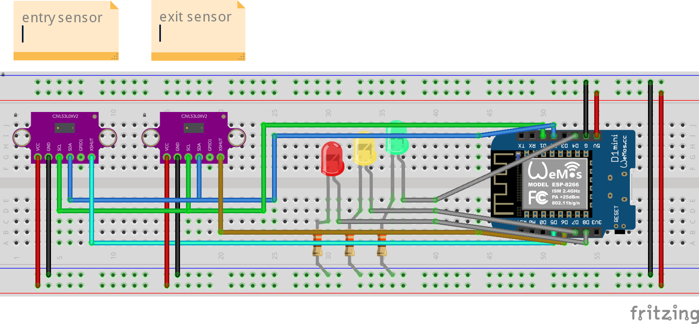

# People sensor / door sensor project
I needed a sensor which detects if someone or something entered or left a room. as i didn't find anything online i decided
to hack together my own little sensor. 

In my first try I utilised two `hc-sr04` ultrasonic sensors, but i quickly realised that their accuracy is horrible.
Another problem was that using two sensors needs a huge timeout (30-60ms) between their distance measurements, otherwise
they  will interfere each other and the results are _unusable_. They work for applications where things move slow, but
for this project I needed more **speeeeed**.

So my second thought was that two light barriers would work best. But one light barrier needs two parts. A sender and a
receiver. So this is also not the best solution to my problem as I want to mount the sensor on a door frame and don't want 
cables running all over the door frame.

Then I learned about time-of-flight (tof) sensors. They measure the distance to an object by shooting an infrared light
ray against the object and wait until the light is reflected back into the receiver. So they can essentially act like
a light barrier. I bought two `vl53l0x` tof sensors for ~8eur, tested them and got to the conclusion that they are 
perfect for this application. Not only do they **not** interfere with each other when relatively close together, these
sensors can also be probed extremely fast. In the fastest mode (continuous back-to-back ranging mode) the sensor has a
measurement ready for use every 20ms. Additionally, I can take measurements from both sensors at the same time. This
adds up to 50 measurements per second, per sensor. This is plenty enough to track a person walking through a door.

# Sample schematic

# Case

# todo
- [ ] make project run from batteries
- [ ] use deep-sleep mode as tof sensors don't need to probe constantly (wakeup from small ir sensor?)
- [ ] wifi stuff

# Useful resources
* **esp8266**
  * exception decoder: https://www.dzombak.com/blog/2021/10/ESP8266-PlatformIO-Serial-Console-Monitoring-with-Exception-Decoding.html
  * exception codes/causes: https://www.espressif.com/sites/default/files/documentation/esp8266_reset_causes_and_common_fatal_exception_causes_en.pdf
  * pinout: https://cdn.shopify.com/s/files/1/1509/1638/files/D1_Mini_Pinout_Diagram.pdf?5603303439559815202
  * board versions: https://docs.wemos.cc/en/latest/d1/index.html

* **hc-sr04 ultrasonic sensor**
  * explanation of sensor: https://randomnerdtutorials.com/complete-guide-for-ultrasonic-sensor-hc-sr04/
  * data sheet: https://docs.google.com/document/d/1Y-yZnNhMYy7rwhAgyL_pfa39RsB-x2qR4vP8saG73rE/edit?pli=1
  * NewPing library: https://bitbucket.org/teckel12/arduino-new-ping/wiki
  * multiple ultrasonic sensors: https://bitbucket.org/teckel12/arduino-new-ping/wiki/Help%20with%2015%20Sensors%20Example%20Sketch

* **vl53l0x laser ranging sensor**
  * good explanation of sensor: https://wolles-elektronikkiste.de/vl53l0x-und-vl53l1x-tof-abstandssensoren
  * data sheet: https://www.st.com/resource/en/datasheet/vl53l0x.pdf

* **misc**
  * interrupts/timers: https://randomnerdtutorials.com/interrupts-timers-esp8266-arduino-ide-nodemcu/
  * finite state design pattern: https://www.aleksandrhovhannisyan.com/blog/implementing-a-finite-state-machine-in-cpp/#modeling-a-light-switch-in-code
  * fsm in c++: https://www.cppstories.com/2023/finite-state-machines-variant-cpp/